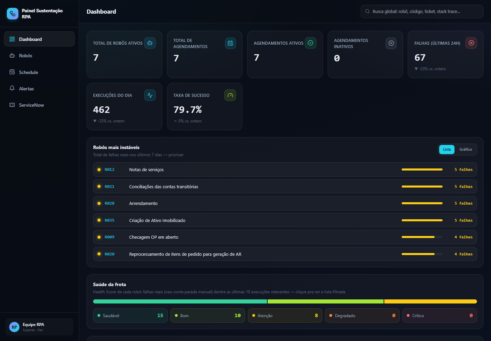
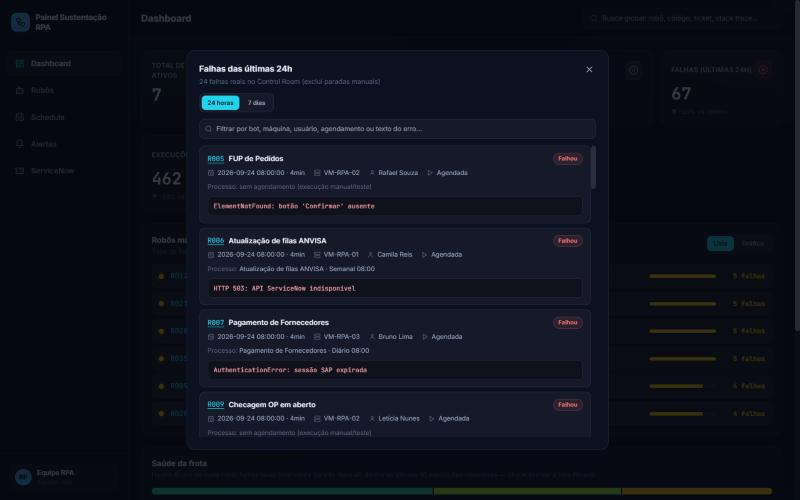
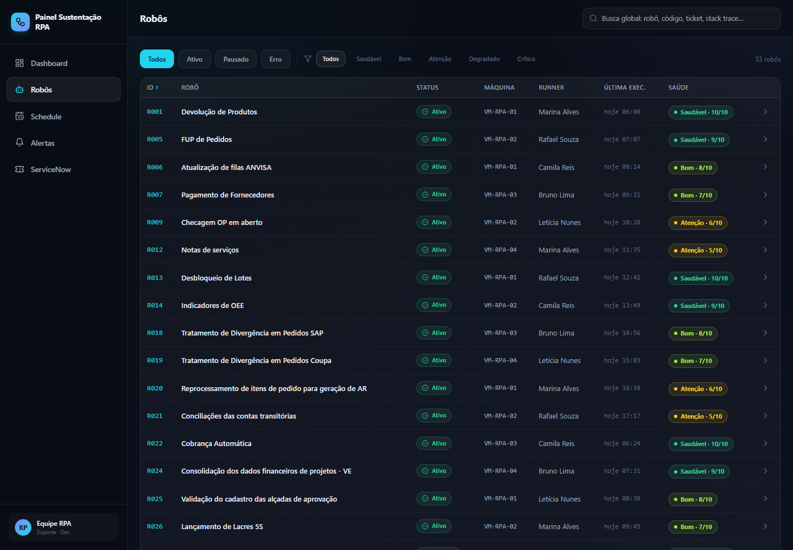
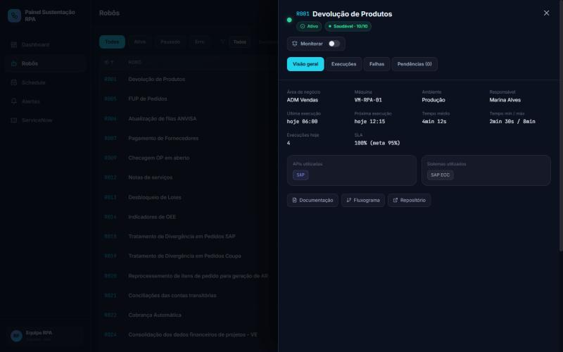
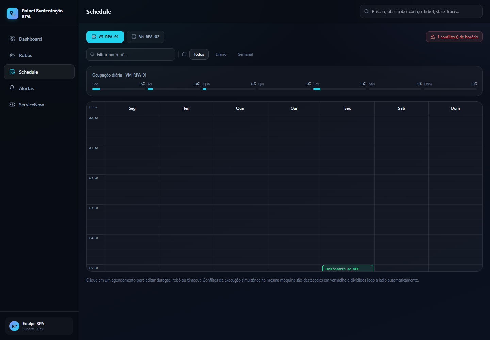
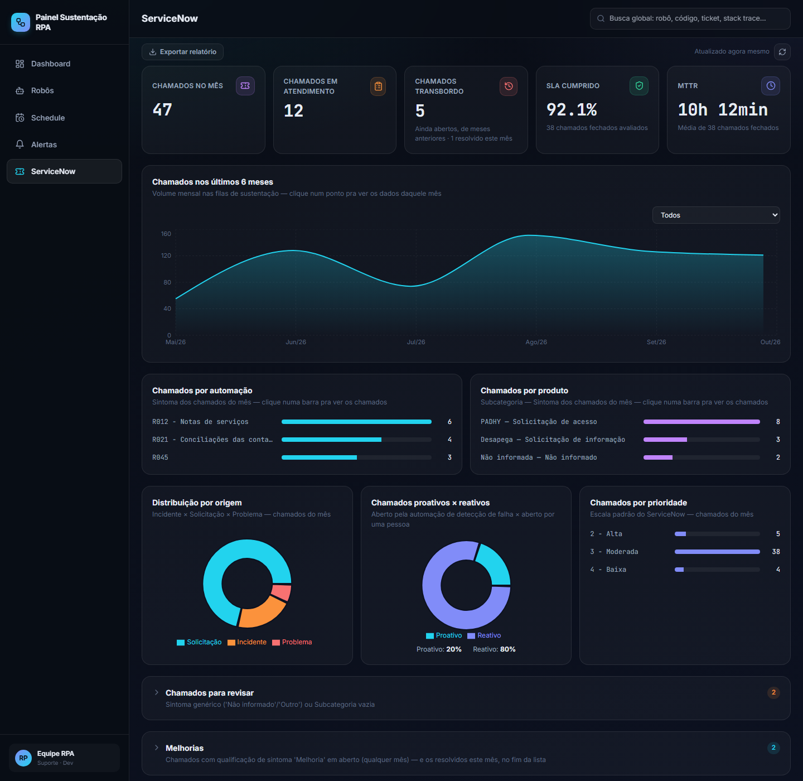

# Painel Sustentação RPA

Painel de operação para times de **sustentação de RPA**: centraliza em um só lugar o que hoje fica espalhado entre a interface do **Automation Anywhere Control Room**, o **ServiceNow** e planilhas de agendamento — robôs, execuções, falhas, agendamentos e chamados, com notificação automática no **Microsoft Teams**.

Roda **100% com dados de exemplo** (mock), sem precisar de credencial nem rede nenhuma — é só clonar e `npm run dev`. Quando quiser, aponta pro seu Control Room e pro seu ServiceNow de verdade trocando algumas variáveis de ambiente; nenhum componente de tela muda.



## Índice

- [O que o painel resolve](#o-que-o-painel-resolve)
- [Telas](#telas)
- [Como rodar](#como-rodar)
- [Stack](#stack)
- [Integrações](#integrações)
- [Como a arquitetura protege o Control Room](#como-a-arquitetura-protege-o-control-room)
- [Estrutura do projeto](#estrutura-do-projeto)
- [Configuração (.env)](#configuração-env)
- [Log de chamadas](#log-de-chamadas)
- [Roadmap](#roadmap)

## O que o painel resolve

Um time de sustentação de RPA normalmente precisa checar **três lugares diferentes** pra saber se está tudo bem: o Control Room (pra ver se os robôs rodaram), o ServiceNow (pra ver os chamados abertos) e uma planilha ou a UI nativa de agendamento (pra ver o que está programado pra rodar). Esse painel junta os três numa visão só, cruzando a informação — por exemplo, mostrando **qual agendamento** estava por trás de uma execução que falhou, ou separando chamados abertos **pela automação de detecção de falha** dos abertos **por uma pessoa**.

## Telas

### Dashboard
KPIs do dia (execuções, falhas, taxa de sucesso, agendamentos ativos/inativos, cada um com tendência vs. ontem), ranking dos robôs mais instáveis (lista ou gráfico), saúde da frota por faixa (Saudável → Crítico, clicável — filtra a tela de Robôs), gráfico de execuções × falhas por dia, e um log de falhas das últimas 24h/7 dias com bot, máquina, usuário, como foi disparada e a mensagem de erro real do Control Room.



### Robôs
Lista com busca, filtro por status e por faixa de saúde, paginação e ordenação por qualquer coluna. Cada linha abre o detalhe do robô.



### Detalhe do robô
Visão geral (área, máquina, ambiente, responsável, SLA), histórico real de execuções com duração, gráfico de execuções, lista de falhas com a mensagem de erro do Control Room, pendências, e o toggle "Monitorar" que liga a notificação no Teams quando esse robô falhar.



### Schedule
Grade semanal por máquina (estilo agenda), com detecção automática de conflito de horário (dois agendamentos na mesma máquina ao mesmo tempo são divididos lado a lado e destacados), filtro por robô/tipo de agendamento e ocupação diária.



### ServiceNow
Resumo do mês (chamados, em atendimento, transbordo, SLA cumprido, MTTR), tendência de 6 meses (clique num ponto pra reabrir a tela inteira naquele mês), chamados por automação/produto/origem/prioridade, chamados proativos (automação) × reativos (pessoa), lista de chamados que precisam de revisão e export para Excel.



### Alertas
Alertas derivados 100% de dado real dos robôs (sem nenhuma linha fixa): robô em erro, falhas recorrentes, timeout elevado, robô pausado — por severidade.

## Como rodar

Pré-requisito: Node.js 18+.

```bash
git clone <este-repositorio>
cd painel-sustentacao-rpa
npm install            # instala o concurrently da raiz
npm run install:all    # instala frontend + backend
npm run dev            # sobe os dois juntos
```

- Frontend: http://localhost:5173
- Backend: http://localhost:4000/api/health

Por padrão os dois já sobem em **modo mock** (dado de exemplo, sem credencial nenhuma — é exatamente o que gerou os prints acima). Rodando só o frontend (`npm run dev:frontend`) ele funciona sozinho, sem precisar do backend.

Pra ligar nas APIs de verdade, veja [Configuração](#configuração-env).

## Stack

| Camada    | Tecnologia                              |
|-----------|------------------------------------------|
| Frontend  | React 18 + TypeScript + Vite + Tailwind  |
| Gráficos  | Recharts                                 |
| Ícones    | lucide-react                             |
| Export    | ExcelJS (carregado sob demanda, só ao exportar) |
| Backend   | Node.js + Express + TypeScript           |
| Dados     | JSON local por padrão — SQLite/SQL Server prontos pra implementar (`repositories/`) |

## Integrações

Tudo passa por uma camada de serviço (`services/`), nunca direto num componente — trocar mock por API real é mudar uma variável de ambiente, não reescrever tela.

- **Automation Anywhere Control Room** (`backend/src/services/automationAnywhereService.ts` + `controlRoomClient.ts`): autenticação via `/v2/authentication`, execuções via `/v3/activity/list`, agendamentos via `/v2/schedule/automations/list`, devices via `/v2/devices/list`. Formato de filtro/paginação é o mesmo padrão usado nas list APIs v2/v3 do Control Room.
- **ServiceNow** (`backend/src/services/serviceNowService.ts` + `serviceNowClient.ts`): lê a tabela nativa `task` (que incident/service_task/problem herdam), com OAuth ou Basic Auth, filtrando pelos `assignment_group` que você configurar.
- **Microsoft Teams**: dois webhooks do Power Automate independentes — um notifica quando um robô **monitorado** falha, outro quando um chamado **novo** abre no ServiceNow. Os dois ficam em modo mock (só logam no console) até você setar `NOTIFY_TEAMS_LIVE=true` / `NOTIFY_TEAMS_SERVICENOW_LIVE=true`.

Trocar o mock pela API oficial:

1. **Frontend** — no `.env`, `VITE_USE_MOCK=false` e `VITE_API_BASE_URL` apontando pro seu backend.
2. **Control Room / ServiceNow** — `CR_MODE=live` / `SERVICENOW_MODE=live` no `.env` do backend, com URL e credencial. A assinatura dos métodos não muda, então controllers e frontend continuam iguais.
3. **Banco corporativo** — troque `DATA_SOURCE` (`json` \| `sqlite` \| `sqlserver`) no `.env` do backend. A fábrica em `repositories/index.ts` seleciona a implementação; basta preencher `SqliteRobotRepository` ou `SqlServerRobotRepository`.

## Como a arquitetura protege o Control Room

Esse não é um detalhe de implementação qualquer — é a decisão de design mais importante do projeto, e vale explicar o porquê.

A tentação óbvia num painel desses é, pra cada robô ou agendamento, disparar uma chamada de histórico individual (`GET /activity?bot=X`). Isso funciona perfeitamente em ambiente de teste com uma dúzia de robôs — e vira uma rajada de **centenas de conexões simultâneas** assim que o ambiente real tem centenas de robôs/agendamentos, porque o número de chamadas cresce junto com o tamanho do ambiente.

A arquitetura atual elimina esse padrão, não apenas reduz:

- **Uma única busca global** de execuções dos últimos 7 dias (`getGlobalActivity7d()`), paginada **sequencialmente** (nunca em paralelo), com filtro de data aplicado no próprio Control Room quando suportado. Todo o resto do sistema (lista de robôs, detalhe, schedule, dashboard, log de falhas) fatia essa mesma busca em memória — **nunca existe uma consulta de atividade por robô ou por agendamento**.
- **Teto fixo de paginação** (10 páginas × 200 registros = 2.000) independente de quantos robôs o ambiente tem — o número de chamadas não escala com o tamanho do ambiente.
- **Cache compartilhado entre todos os usuários** (90s para execuções, 5min para agendamentos/devices) com *single-flight*: se duas requisições chegam com o cache frio, a segunda espera a busca que já está em andamento em vez de disparar outra.
- **Login com espera compartilhada**: duas chamadas que precisam autenticar ao mesmo tempo não disparam dois logins (o Control Room costuma aceitar só uma sessão ativa por usuário).
- **Timeout de 20s** em toda chamada HTTP — uma falha de rede gera um erro claro na tela, não trava a tela pra sempre.
- **Nada roda em segundo plano.** Sem timer no backend, sem polling no frontend — o painel só chama o Control Room quando alguém está de fato olhando uma tela, e nunca mais de uma vez a cada 90s.

Resultado: o pior caso de uma carga fria (ninguém usando o painel há mais de 5 minutos) é **~13 a 15 chamadas sequenciais**, e depois disso, zero chamadas novas por até 90 segundos — não importa se é 1 usuário ou 50 usando o painel ao mesmo tempo.

## Estrutura do projeto

```
frontend/src/
  types/         Contratos TypeScript (Robot, ScheduleEntry, FailureLog...)
  constants/     Tema (tokens de design), navegação, dados de exemplo
  utils/         Health Score, formatação de data/duração, export Excel
  models/        Dados mockados (fallback / desenvolvimento offline)
  api/           httpClient (timeout + erro tratado nas chamadas pro backend)
  services/      AutomationAnywhereService, ServiceNowService  <- ponto de troca
  hooks/         useApp (contexto compartilhado entre páginas)
  components/    ui/ (Card, StatCard, Panel...), layout/ (Sidebar, TopBar), dashboard/ (modais)
  pages/         Dashboard, Robots, RobotDetail, Schedule, ServiceNow, Alerts

backend/src/
  routes/        Definição de endpoints
  controllers/   Orquestração das requisições
  services/      Regra de negócio + integrações externas (Control Room, ServiceNow, Teams)
  repositories/  Padrão Repository: IRobotRepository + Json/Sqlite/SqlServer
  data/          JSON de robôs e schedule (fonte do modo mock)
  config/        Variáveis de ambiente
```

## Configuração (`.env`)

Cada pacote tem seu próprio `.env.example` (copie para `.env` e ajuste):

**`frontend/.env`**
```bash
VITE_USE_MOCK=true                             # false para consumir o backend real
VITE_API_BASE_URL=http://localhost:4000/api
VITE_PROACTIVE_REQUESTER=svc.rpa.bot           # username que SUA automação usa pra abrir chamado
```

**`backend/.env`** (resumo — veja `backend/.env.example` para a lista completa comentada)
```bash
CR_MODE=mock                                   # live chama o Control Room de verdade
CR_URL=https://seu-control-room.automationanywhere.digital
CR_USERNAME=DOMINIO\usuario
CR_API_KEY=

SERVICENOW_MODE=mock                           # live chama o ServiceNow de verdade
SERVICENOW_URL=https://suaempresa.service-now.com
SERVICENOW_ASSIGNMENT_GROUPS=sys_id_grupo_1,sys_id_grupo_2

NOTIFY_TEAMS_LIVE=false                        # true dispara notificação de verdade
TEAMS_WEBHOOK_URL=
```

## Log de chamadas

Antes de apontar pra um ambiente de verdade, dá pra conferir exatamente quantas chamadas o painel faz: console + `backend/logs/calls.log` + `GET /api/debug/calls` (resumo com totais, cache hit/miss e as últimas 100 chamadas). Ligado por padrão; `LOG_CALLS=false` desliga. Só registra metadados (método, status, tempo, tamanho) — nunca corpo, token ou senha.

## Roadmap

- Autenticação Active Directory / Azure AD e perfis (Admin, Dev, Suporte, Gestor)
- Notificação de falha nova em tempo real (som/badge) enquanto o painel está aberto
- Auditoria de alterações
- Agrupamento de falhas por causa raiz (mesma mensagem de erro em bots diferentes)
- Dashboards dedicados por área de negócio
